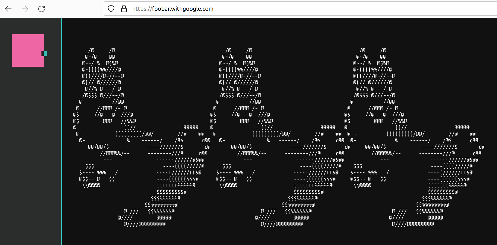

# Google foobar challenge

This is my take on with the Google foobar challenge.

* Level 1 chapter 1: at that time I didn't realize what is this foobar
  challenge was about, so I didn't notice neiter the task conditions nor name.
  This small snippet is all thats left for the first level  
  [solution.py](ch1-1/solution.py)
* Level 2 chapter 1: **Bunny Prisoner Locating**  
  [readme.txt](ch2-1/readme.txt)  
  [solution.py](ch2-1/solution.py)
* Level 2 chapter 2: **Ion Flux Relabeling**  
  [readme.txt](ch2-2/readme.txt)  
  [solution.py](ch2-2/solution.py)
* Level 3 chapter 1: **Find the Access Codes**  
  [readme.txt](ch3-1/readme.txt)  
  [solution.py](ch3-1/solution.py)
* Level 3 chapter 2: **Bomb, Baby!**  
  [readme.txt](ch3-2/readme.txt)  
  [solution.py](ch3-2/solution.py)
* Level 3 chapter 3: **Prepare the Bunnies' Escape**  
  [readme.txt](ch3-3/readme.txt)  
  [solution.py](ch3-3/solution.py)
* Level 4 chapter 1: **Running with Bunnies**  
  [readme.txt](ch4-1/readme.txt)  
  [solution.py](ch4-1/solution.py)
* Level 4 chapter 2: **Distract the Trainers**  
  [readme.txt](ch4-2/readme.txt)  
  [solution.py](ch4-2/solution.py)
* Level 5 chapter 1: **Disorderly Escape**  
  [readme.txt](ch5-1/readme.txt)  
  [solution.py](ch5-1/solution.py)

